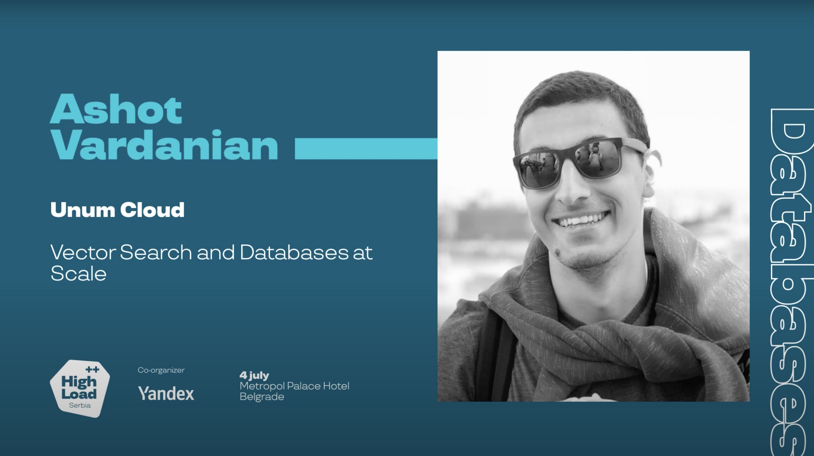

# Hey, I'm Ash!

- Founder of [Unum Cloud](https://unum.cloud).
- Organizer of [Armenia's 🇦🇲 C++](https://github.com/cpp-armenia/meetings) group.
- CS researcher with 0 publications 😅.
- 2x Astrophysics dropout 🤦🤦.
- Ex Investor in ½ of Forbes Cloud 100 companies.
- Fluent in English, Russian & Armenian.

For the past 15 years, I have been coding mainly in C++, CUDA, Python, and optimizing Assembly on x86/ARM. My handle is @ashvardanian on [LinkedIn](https://linkedin.com/in/ashvardanian), [Twitter](https://twitter.com/ashvardanian), [Facebook](https://fb.com/ashvardanian), and [YouTube](https://youtube.com/playlist?list=PL2kcrNAeGTFzZbccNB3P_xruYPskMmwRT).

## Materials

- [Talks](https://ashvardanian.com/talks)
- [Personal Blog](https://ashvardanian.com/archives)
- [Corporate Blog](https://www.unum.cloud/blog)
- Cherry Picks:

<table>
  <tr>
    <td valign="top" width=190>
      
    </td>
    <td valign="top">      
      Vector and Semantic Search, Databases, 
      Monolith vs Micro-Services vs Modular Architecture,
      Embeddings, Quantization, JIT, SIMD
    </td>
    <td valign="top"  width=190>
      
    </td>
    <td valign="top">      
      Linux, mmap, io_uring, Intel SPDK, ACID transactions, Key Value Stores,
      UKV, LevelDB, RocksDB, UDisk, Log Structured Merge Trees
    </td>
  </tr>
  <tr>
    <td valign="top" width=190>
      
    </td>
    <td valign="top">
      Python, Data-Science, GPUs, Rapids, Pandas vs cuDF, NetworkX vs cuGraph, NumPy vs CuPy,
      Modin, Dask, Ray, PyTorch, Apache Arrow, BLAS, RetworkX
    </td>
    <td valign="top" width=190>
      
    </td>
    <td valign="top">
      General Purpose GPU Programming, OpenCL, CUDA, Vulkan, SyCL,
      Hardware vs Logical Abstractions, Parallel Algorithms
    </td>
  </tr>
</table>
