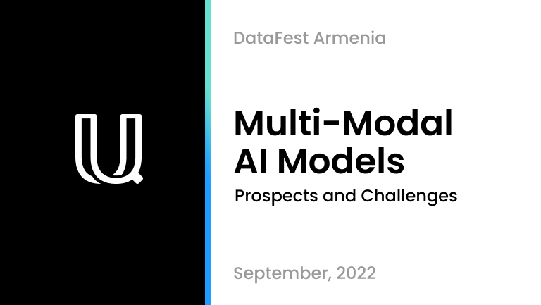

### Hey, I'm Ash!

* Founder of [Unum.cloud](https://unum.cloud).
* Head of [Armenias 🇦🇲 C++](https://t.me/cpparm) community.
* Artificial Intelligence and Computer Science [researcher](https://github.com/unum-cloud).
* Ex. Astrophysicist.
* Fluent in English, Russian & Armenian.

For the past 15 years, I have been coding mainly in C++, CUDA, Python, and Assembly on x86/ARM. 
I am on [LinkedIn](https://linkedin.com/in/ashvardanian), [Twitter](https://twitter.com/ashvardanian), [Facebook](https://fb.com/ashvardanian), and [YouTube](https://youtube.com/playlist?list=PL2kcrNAeGTFzZbccNB3P_xruYPskMmwRT).

## My Lectures

Most materials are in English unless ~~literally~~ flagged otherwise.
The absolute majority is on the subjects of Systems Design, Computer Science, and Artificial Intelligence.
The 🗣️ talking head links aren't technical, and in the ones with a 👯‍♂️ - I am just a wingman supporting another speaker.

<table>
  <tr>
    <td>
      

         
        AI Research, Deep-Learning, Neural Networks, Multi-Modal Architectures, 
        Contrastive Losses, Semantic Search, Quality of Embeddings, 
        Lipshitz Constraints, Socratic Models
      

    </td>
    <td>
      

         
        Python, Data-Science, GPUs, Rapids, Pandas vs cuDF, NetworkX vs cuGraph, NumPy vs CuPy,
        Modin, Dask, Ray, PyTorch, Apache Arrow, BLAS, RetworkX
      

    </td>
    <td>
      

         
        C++, Assembly, x86 and Arm SIMD Instructions, Substring Search, Heuristics,
        Speculative Execution, Branchless Computing, Frequency Scaling Licenses
      

    </td>
    <td>
      

         
        General Purpose GPU Programming, OpenCL, CUDA, Vulkan, SyCL,
        Hardware vs Logical Abstractions, Parallel Architectures and Algorithms
      

    </td>
  </tr>
</table>

### 2022

* **3M: Prospects and Challenges with Multi-Modal Models in AI Research** @ [DataFest](https://datafest.am). [YouTube](https://youtu.be/p3RMkiqd7vY). [Slides](https://drive.google.com/file/d/166UgMRVM1ORJPWQ74oRc2UH-bKmPHbqI/view).
* **Accelerated Data Science Libraries** @ [PyData Conference](https://pydata.org/yerevan2022/). [YouTube](https://youtu.be/OxAKSVuW2Yk). [Slides](https://drive.google.com/file/d/168_Ctx0n6Jtw7ufSlTL3skCZR--lw-C0/view).
* **Role of C++ in Machine Learning discussion** @ CppRussia. [YouTube](https://youtu.be/gO_bVvIN7HM). 🇷🇺
* **Life Altering Technologies** @ [Global Innovation Forum](https://fast.foundation/gif/2022/). [YouTube](https://www.youtube.com/watch?v=EBh9_7o31bI&t=24447s).
* **Persistent Memory Technologies Overview** @ [AMD](https://amd.com) & [Xilinx](https://www.xilinx.com).
* From OpenCL, Thrust & CUB to raw CUDA Kernels & SyCL @ CppArm Meetup #3. [GitHub](https://github.com/unum-cloud/ParallelReductions).
* Fast Inference for Large Language Models with Vladimir Orshulevich @ PyData Meetup #2. [YouTube](https://youtu.be/tKwL-Q7INnQ). 👯‍♂️
* Unsafe Math, GCC Attributes, and Nifty Tricks for Google Benchmark @ CppArm Meetup #4. [GitHub](https://github.com/ashvardanian/BenchmarkingTutorial).
* A Practical Approach to Error Handling by Arno Schödl @ CppRussia. [YouTube](https://youtu.be/zNbmFRaetTA). 👯‍♂️
* Accelerated Data-Science Tools Overview @ PYerevan Meetup #16. [YouTube](https://youtu.be/coTgcwnzvAg).
* Bindings 101: CPython, cGo, and Java Native Interface @ CppArm Meetup #5. [GitHub](github.com/unum-cloud/ukv), [YouTube](https://youtu.be/psmfAg1Nc3s).

### 2021

* **On High-Performance Computing** @ Mars Podcast. [YouTube](https://youtu.be/yK4Bd-6Mxk0). 🇦🇲
* Evolution: C++11, 14, 17, 20, 23, 26? @ CppArm Meetup #2. [YouTube](https://youtu.be/jtttoxkjTIA)
* Peta-Scale software in 2021 @ Code Republic. [YouTube](https://youtu.be/8R-43hfnPHI). [Slides](https://drive.google.com/file/d/166nCWQH1-5KIPNmN4rUzebAW7mi6_eY5/view) 🇦🇲
* On the Gituzh Scientific Initiative @ FM106.5. [YouTube](https://youtu.be/89eDghXaZjI). 🇦🇲 🗣️
* SIMD with EVE by Denis Yaroshevskiy @ CppRussia. [YouTube](https://youtu.be/CV0e-2a_dTI). 👯‍♂️

### 2020

* **SIMD = Performance you have already paid for** @ [CppRussia Conference](https://2020.cppconf-piter.ru/2020/spb/talks/23g3egeumhe3p4fd66pbar/). [GitHub](https://github.com/ashvardanian/SubstringSearchBenchmark). [YouTube](https://youtu.be/6Sh9QWdzo58). [Slides](https://drive.google.com/file/d/16BsyqGWjpNfqG0vAb21l0eySbChC_njJ/view). 🇷🇺
* **SIMD. Frequency Scaling Licenses and Speculative Execution** @ CppArm Meetup #1. [GitHub](https://github.com/ashvardanian/CppBenchSubstrSearch), [YouTube](https://youtu.be/ft51yJ9mDcc?t=140).
* Conversing about High-Performance Computing @ Pure Virtual Cast #4. [YouTube](https://youtu.be/dCdBFB4LDjw). 🇷🇺
* Artsakh Must Be Independent. [YouTube](https://youtu.be/sN8CsCgDlHY). 🗣️

### 2019

* **Deep dive into GPGPU programming** @ [CppRussia Conference](https://cppconf-piter.ru/en/2020/spb/talks/23g3egeumhe3p4fd66pbar/?fbclid=IwAR26hl3tEhw1os0J6oLzsVPTOAuSGkZIMzwq689tEq8NH5_V7b3MHV8f_zU). [GitHub](https://github.com/ashvardanian/SandboxGPUs). [YouTube](https://youtu.be/AA4RI6o0h1U). [Slides](https://drive.google.com/file/d/16AicAl99t3ZZFnza04Wnw_Vuem0w8lc7/view).
* **Computational graphs and AI in C++** @ [Synopsys](https://www.synopsys.com) HQ. [GitHub](https://github.com/ashvardanian/NeuralSTL).
* Efficient GPGPU Programming @ [JetBrains](https://www.jetbrains.com) HQ. [GitHub](https://github.com/ashvardanian/SandboxGPUs), [YouTube](https://youtu.be/BUtHOftDm_Y).
